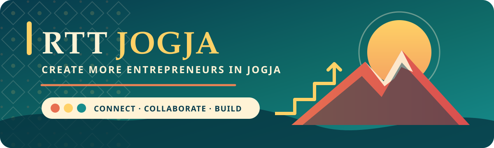

  

  A community focused on encouraging entrepreneurship in Jogja.

  
  
  

## Building in Public

<table>
  <tr>
    <td width="50%" valign="top">
      <h3><a href="https://github.com/RTTJogja/ditya">Ditya</a></h3>
      
A meeting-scheduling project with a guided participant flow, calendar conflict visibility, automated tests, and product documentation.

      

        
        
        
      

    </td>
    <td width="50%" valign="top">
      <h3><a href="https://github.com/RTTJogja/dcse-summer-ppt-public">Empowering the Tri Dharma with AI Agents</a></h3>
      
A public lecture-deck release with the recommended presentation and supporting output artifacts.

      

        
        
        
      

    </td>
  </tr>
</table>

  <a href="https://www.bukitvista.com/round-table-talk-jogja">Learn more about Round Table Talk Jogja</a>
  &nbsp;&middot;&nbsp;
  <a href="https://github.com/RTTJogja">Browse the organization</a>

